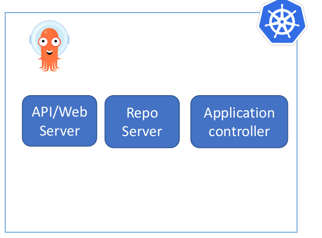
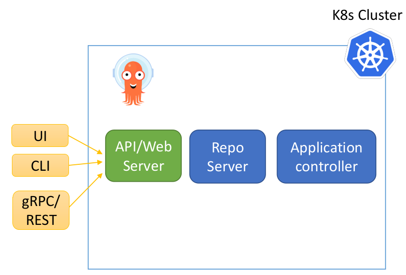
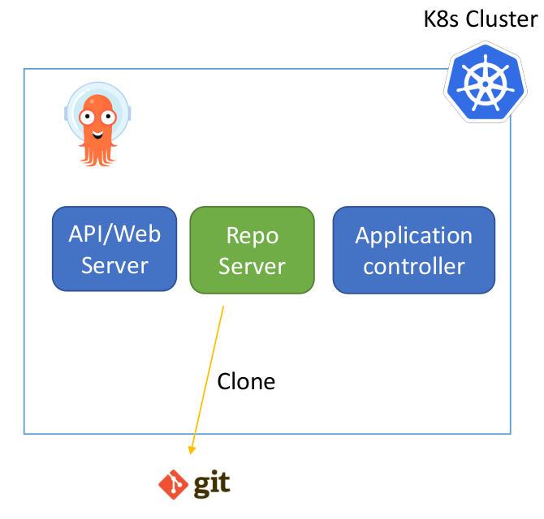
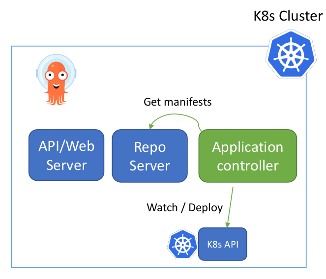
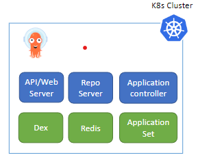

# ArgoCD Architecture

**ArgoCD consist of 3 main components**
- ArgoCD Server (API + Web Server).
- ArgoCD Repo Server.
- ArgoCD Application Controller.

**Components / API – Web Server**

- Its a gRPC/REST server which exposes the API consumed by the Web UI, CLI.
    - Application management (Create, Update, Delete).
    - Application operations (ex: Sync, Rollback)
    - Repos and clusters management.
    - Authentication.

    

**Components / Repo Server K8s Cluster**
- Its an internal service that responsible of cloning remote git repos and generate the needed k8s manifests.
    - Clone git repo.
    - Generate k8s manifests.

    

**Components / Application controller K8s Cluster**
- Its a Kubernetes controller which continuously monitors running applications and compares the current, live state against the desired target state.
    - Communicate with Repo server to get the generated manifests.
    - Communicate with k8s API to get actual cluster state.
    - Deploy apps manifests to destination clusters.
    - Detects OutofSync Apps and take corrective actions “If needed”.
    - Invoking user-defined hooks for lifecycle events (PreSync, Sync, PostSync).

    

**Additional Components**
- Redis: used for caching.
- Dex: identity service to integrate with external identity providers.
- ApplicationSet Controller : It automates the generation of Argo CD Applications.

