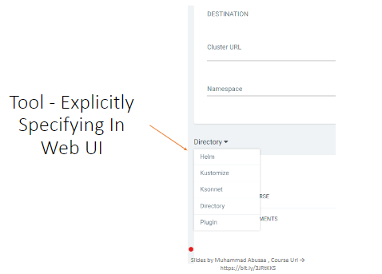

# ArgoCD Application

## Application is a Kubernetes resource object representing a deployed application instance in an environment.
- It is defined by two key pieces of information:
    - Source: reference to the desired state in Git (repository, revision, path)
    - Destination: reference to the target cluster and namespace.

- Applications can be created using below options
    - Declaratively “Yaml ”. (Recommended)
    - CLI
    - Web UI
        - click on `newapp`
        - Fill the form
        - Create app
        - sync app

## Create Application in docker-kubernetes using CLI Approach 
```sh
# Create application app-2
argocd app create shaheenbook--repo https://github.com/mabusaa/argocd-example-apps.git --revision master --path guestbook --dest-server https://kubernetes.default.svc --dest-namespace shaheen --sync-option CreateNamespace=true

# Sync application
argocd app sync app-2

# verify app
argocd app list
```


## Create Application in docker-kubernetes using declarative approach
### Create Application manifest file
### application.yaml
```yml
apiVersion: argoproj.io/v1alpha1
kind: Application
metadata: 
  name: guestbook
  namespace: argocd
spec: 
  destination: 
    namespace: guestbook
    server: "https://kubernetes.default.svc"
  project: default
  source: 
    path: guestbook
    repoURL: "https://github.com/mabusaa/argocd-example-apps.git"
    targetRevision: master
  syncPolicy:
    syncOptions:
      - CreateNamespace=true
```

### Create application
```sh
kubectl apply -f ./01-manifest-files/
```
### verify application
```sh
kubectl get application -n argocd

argocd app list
```


# Identifying tool
- helm
- Kustomize application
- Directory of YAML file
- Jsonnet
### application.yaml file
```yml
apiVersion: argoproj.io/v1alpha1
kind: Application
metadata: 
  name: guestbook
  namespace: argocd
spec: 
  destination: 
    namespace: guestbook
    server: "https://kubernetes.default.svc"
  project: default
  source: 
    path: guestbook
    repoURL: "https://github.com/mabusaa/argocd-example-apps.git"
    targetRevision: master
    # mention any as per your tools
    # directory of yaml
    directory:
     recurse: true
    # For helm 
    helm:
      releaseName: guestbook
    # Kustomize
    kustomize:
      version: v3.5.6
  syncPolicy:
    syncOptions:
      - CreateNamespace=true
```
#### If you don’t explicitly specify a tool, then its detected as follows:
  - Helm charts : if there is a file as Chart.yaml
  - Kustomize: if there's a kustomization.yaml, kustomization.yml, or Kustomization
  - Otherwise it is assumed to be a plain Yaml directory application
#### Tool - Explicitly Specifying In Web UI



## Helm Option
- Helm Applications an be deployed from two sources
    - Git Repo
    - Helm Repo

### Helm from git repo
```yml
apiVersion: argoproj.io/v1alpha1
kind: Application
metadata:
    name: guestbook
    namespace: argocd
spec:
    destination:
        namespace: guestbook
        server: "https://kubernetes.default.svc"
    project: default
    source:
        path: helm guestbook
        repoURL: "https://github.com/argoproj/argocd-example-apps.git"
        targetRevision: HEAD
```

### Helm from Helm repo
```yml
apiVersion: argoproj.io/v1alpha1
kind: Application
metadata:
    name: guestbook
    namespace: argocd
spec:
    destination:
        namespace: guestbook
        server: "https://kubernetes.default.svc"
    project: default
    source:
        chart: sealed-secret
        repoURL: "https://bitnami-labs.github.io/sealed-secrets"
        targetRevision: 1.16.1 # For Helm, this refers to the chart
```
### ArgoCD provies the below for options
- Release name.
```yml
    source:
        path: helm guestbook
        repoURL: "https://github.com/argoproj/argocd-example-apps.git"
        targetRevision: HEAD
        helm:
            releaseName: # override release name (defaults to application name)
```
- Values files
```yml
    source:
        path: helm guestbook
        repoURL: "https://github.com/argoproj/argocd-example-apps.git"
        targetRevision: HEAD
        helm:
          valuesFiles: # can set multi values files, (defaults to values.yaml in source repo)
            - values-prod.yaml
```
- Parameters
```yml
    source:
        path: helm guestbook
        repoURL: "https://github.com/argoproj/argocd-example-apps.git"
        targetRevision: HEAD
        helm:
          parameters: # override any values in a values.yaml
            - name: “service.type”
              value: “LoadBalancer”
            - name: “image.tag”
              value: “v2”
```
- File parameters
```yml
    source:
        path: helm guestbook
        repoURL: "https://github.com/argoproj/argocd-example-apps.git"
        targetRevision: HEAD
        helm:
          fileParameters: # set parameter values from a file
            - name: config
              value: files/config.json
```
- Values as block file.
```yml
    source:
        path: helm guestbook
        repoURL: "https://github.com/argoproj/argocd-example-apps.git"
        targetRevision: HEAD
        helm:
          values: |
            ingress:
                enabled: true
                path: /
                hosts:
                - mydomain.example.com
```

### Create helm tools application
- Create app
```sh
kubectl apply -f ./02-manifest-files/
```
- By default release name is application name
- change release name
##### add below code in spec.source
```yml
helm:
    releaseName: my-release
```# ArgoCD Application

## Application is a Kubernetes resource object representing a deployed application instance in an environment.
- It is defined by two key pieces of information:
    - Source: reference to the desired state in Git (repository, revision, path)
    - Destination: reference to the target cluster and namespace.

- Applications can be created using below options
    - Declaratively "Yaml". (Recommended)
    - CLI
    - Web UI
        - click on `newapp`
        - Fill the form
        - Create app
        - sync app

## Create Application in docker-kubernetes using CLI Approach 
```sh
# Create application app-2
argocd app create app-2 --repo https://github.com/mabusaa/argocd-example-apps.git --revision master --path guestbook --dest-server https://kubernetes.default.svc --dest-namespace app-2 --sync-option CreateNamespace=true

# Sync application
argocd app sync app-2

# verify app
argocd app list
```


## Directory Options
### ArgoCD provides the below as options
- Recursive: include all files in sub directories.
- Jsonnet 
    - External Vars : list of external variables for Jsonnet
    - Top level Arguments.
### Directory Recursive
```yml
    source:
        path: helm guestbook
        repoURL: "https://github.com/argoproj/argocd-example-apps.git"
        targetRevision: HEAD
        directory:
          recurse: true # include all sub driectories
```
### Directory Jsonnet External Variables
```yml
    source:
        path: helm guestbook
        repoURL: "https://github.com/argoproj/argocd-example-apps.git"
        targetRevision: HEAD
        directory:
          jsonnet:
            extVars:
            - name: service
              value: “internal”
```

### Directory Jsonnet External Variables
```yml
    source:
        path: helm guestbook
        repoURL: "https://github.com/argoproj/argocd-example-apps.git"
        targetRevision: HEAD
        directory:
          jsonnet:
            tlas:
            - name: service
              value: “internal”
              code: false
```

## Multiple sources for application
- Combine related resources that exists indifferent  repos into one application
```yml
    sources:
      - chart: redis
        repoURL: "https://charts-bitnami.com/bitnami"
        targetRevision: 17.10.2 # For Helm, this refers to the chart
      - chart: prometheus-redis-exporter
        repoURL: "https://prometheus-community.github.io/helm-charts"
        targetRevision: 5.3.2
```
- remote helm chart with git-hosted values file
```yml
    sources:
      - chart: ingress-nginx
        repoURL: "https://kubernetes.github.io/ingess-nginx"
        targetRevision: 4.6.2
        helm:
          valuesFiles:
            - $values/ingress-nginx/values.yaml
      - repoURL: "https://github.com/argoproj/argocd-example-apps.git"
        ref: values
        targetRevision: master
```

# Ref
- *https://github.com/mabusaa/argocd-example-apps.git*
- *https://github.com/mabusaa/argocd-course-apps-definitions.git*