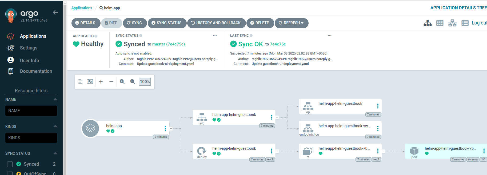
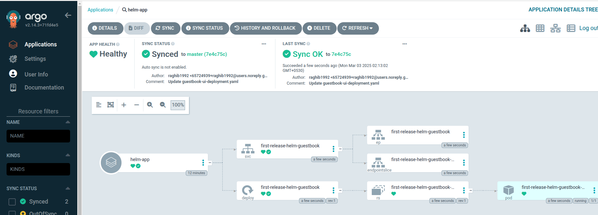

# ArgoCD Application

## Application is a Kubernetes resource object representing a deployed application instance in an environment.
- It is defined by two key pieces of information:
    - Source: reference to the desired state in Git (repository, revision, path)
    - Destination: reference to the target cluster and namespace.

- Applications can be created using below options
    - Declaratively “Yaml ”. (Recommended)
    - CLI
    - Web UI
        - click on `newapp`
        - Fill the form
        - Create app
        - sync app

## Create Application in docker-kubernetes using CLI Approach 
```sh
# Create application app-2
argocd app create shaheenbook --repo https://github.com/mabusaa/argocd-example-apps.git --revision master --path guestbook --dest-server https://kubernetes.default.svc --dest-namespace shaheen --sync-option CreateNamespace=true
```


# **Let Create First Application
1. Create repo in github where we create manifest for k8s resources which will be deployed by argocd
```t
https://github.com/raghib1992/argocd-example-apps/guestbook
```
2. Create Argocd application Manifest files at folder **02-manifest-files**
### application.yml
```yml
apiVersion: argoproj.io/v1alpha1
kind: Application
metadata: 
  name: guestbook
  namespace: argocd
spec: 
  destination: 
    namespace: guestbook
    server: "https://kubernetes.default.svc"
  project: default
  source: 
    path: guestbook
    repoURL: "https://github.com/raghib1992/argocd-example-apps"
    targetRevision: master
  syncPolicy:
    syncOptions:
      - CreateNamespace=true
```
3. Apply manifest file
```
kubectl apply -f 02-manifest-files/01-application.yml
```
4. CHeck for application resource created in ArgoCD
```sh
kubectl -n argocd get application

# Output
NAME       SYNC STATUS   HEALTH STATUS
uzmabook   OutOfSync     Missing

# ALso verify app by argocd cli
argocd login <argocd host>
argocd login localhost:8080
username
password

argocd app list
```
5. Synchronize Application with github repo to argocd create k8s resource
### *By default ArgoCD doesn't Sync application*
```sh
# Method 1
# Using Argocd cli
argocd app sync uzmabook

# Method 2
# From ArgoCD UI
Click -> sync -> SHYNCHRONIZE
```

6. verify app
```
argocd app list
```

# Create application using UI

# Create Appliation using argocd cli
1. login using argocd cli
```
argocd login <host>
argocd login localhost:8080
username
password
```
2. list present app
```
argocd app list
```
3. Create application
```
argocd app create bushrabook --repo https://github.com/raghib1992/argocd-example-apps.git --revision master --path guestbook --dest-server https://kubernetes.default.svc --dest-namespace staging --sync-option CreateNamespace=true
```
4. Using Argocd cli
```
argocd app sync bushrabook
```


# Identifying tool
- helm
- Kustomize application
- Directory of YAML file
- Jsonnet
### How to mention tool in application.yaml file
```yml
apiVersion: argoproj.io/v1alpha1
kind: Application
metadata: 
  name: guestbook
  namespace: argocd
spec: 
  destination: 
    namespace: guestbook
    server: "https://kubernetes.default.svc"
  project: default
  source: 
    path: guestbook
    repoURL: "https://github.com/mabusaa/argocd-example-apps.git"
    targetRevision: master
    # mention any as per your tools
    # directory of yaml
    directory:
     recurse: true
    # For helm 
    helm:
      releaseName: guestbook
    # Kustomize
    kustomize:
      version: v3.5.6
  syncPolicy:
    syncOptions:
      - CreateNamespace=true
```
#### If you don’t explicitly specify a tool, then its detected as follows:
  - Helm charts : if there is a file as Chart.yaml
  - Kustomize: if there's a kustomization.yaml, kustomization.yml, or Kustomization
  - Otherwise it is assumed to be a plain Yaml directory application
#### Tool - Explicitly Specifying In Web UI


1. Helm Option
- Helm Applications an be deployed from two sources
    - Git Repo
    - Helm Repo

    i. Helm from git repo
    ### Mention git repo for Helm source
    ```yml
    apiVersion: argoproj.io/v1alpha1
    kind: Application
    metadata:
        name: guestbook
        namespace: argocd
    spec:
        destination:
            namespace: guestbook
            server: "https://kubernetes.default.svc"
        project: default
        source:
            path: helm-guestbook
            repoURL: "https://github.com/argoproj/argocd-example-apps.git"
            targetRevision: HEAD
    ```

    ii. Helm from Helm repo
    ### Mention helm chart for Helm source
    ```yml
    apiVersion: argoproj.io/v1alpha1
    kind: Application
    metadata:
        name: guestbook
        namespace: argocd
    spec:
        destination:
            namespace: guestbook
            server: "https://kubernetes.default.svc"
        project: default
        source:
            chart: sealed-secret
            repoURL: "https://bitnami-labs.github.io/sealed-secrets"
            targetRevision: 1.16.1 # For Helm, this refers to the chart
    ```

    ### ArgoCD provies the below for options
    1. **Release name**
    ### By default release name is application, but override release name (defaults to application name)
    ```yml
        source:
            path: helm guestbook
            repoURL: "https://github.com/argoproj/argocd-example-apps.git"
            targetRevision: HEAD
            helm:
                releaseName: # override release name (defaults to application name)
    ```
    2. **Values files**
    ### can set multi values files, (defaults to values.yaml in source repo)
    ```yml
        source:
            path: helm guestbook
            repoURL: "https://github.com/argoproj/argocd-example-apps.git"
            targetRevision: HEAD
            helm:
              valuesFiles: # can set multi values files, (defaults to values.yaml in source repo)
                - values-prod.yaml
    ```
    3. Parameters
    ### override any values in a values.yaml
    ```yml
        source:
            path: helm guestbook
            repoURL: "https://github.com/argoproj/argocd-example-apps.git"
            targetRevision: HEAD
            helm:
              parameters: # override any values in a values.yaml
                - name: “service.type”
                  value: “LoadBalancer”
                - name: “image.tag”
                  value: “v2”
    ```
    4. File parameters
    ### set parameter values from a file
    ```yml
        source:
            path: helm guestbook
            repoURL: "https://github.com/argoproj/argocd-example-apps.git"
            targetRevision: HEAD
            helm:
              fileParameters: # set parameter values from a file
                - name: config
                  value: files/config.json
    ```
    5. Values as block file.
    ### Write block file in values in applicationmanifest file
    ```yml
        source:
            path: helm guestbook
            repoURL: "https://github.com/argoproj/argocd-example-apps.git"
            targetRevision: HEAD
            helm:
              values: |
                ingress:
                    enabled: true
                    path: /
                    hosts:
                    - mydomain.example.com
    ```

## Create helm tools application
1. Create app
```sh
kubectl apply -f ./02-manifest-files/02-application.yaml
```
2. Sync the application
3. Now chnge the release name, by default release name is app name

4. Modify Application Manifest file, and add
```
helm:
  releaseName: first-release
```
5. SYNCHRONIZE application with selecting PRUNE, which means delete and recreate with new release name



- By default release name is application name
- change release name
##### add below code in spec.source
```yml
helm:
    releaseName: my-release
```# ArgoCD Application

## Application is a Kubernetes resource object representing a deployed application instance in an environment.
- It is defined by two key pieces of information:
    - Source: reference to the desired state in Git (repository, revision, path)
    - Destination: reference to the target cluster and namespace.

- Applications can be created using below options
    - Declaratively "Yaml". (Recommended)
    - CLI
    - Web UI
        - click on `newapp`
        - Fill the form
        - Create app
        - sync app

## Create Application in docker-kubernetes using CLI Approach 
```sh
# Create application app-2
argocd app create app-2 --repo https://github.com/mabusaa/argocd-example-apps.git --revision master --path guestbook --dest-server https://kubernetes.default.svc --dest-namespace app-2 --sync-option CreateNamespace=true

# Sync application
argocd app sync app-2

# verify app
argocd app list
```


## Directory Options
### ArgoCD provides the below as options
- Recursive: include all files in sub directories.
- Jsonnet 
    - External Vars : list of external variables for Jsonnet
    - Top level Arguments.
### Directory Recursive
```yml
    source:
        path: helm guestbook
        repoURL: "https://github.com/argoproj/argocd-example-apps.git"
        targetRevision: HEAD
        directory:
          recurse: true # include all sub driectories
```
### Directory Jsonnet External Variables
```yml
    source:
        path: helm guestbook
        repoURL: "https://github.com/argoproj/argocd-example-apps.git"
        targetRevision: HEAD
        directory:
          jsonnet:
            extVars:
            - name: service
              value: “internal”
```

### Directory Jsonnet External Variables
```yml
    source:
        path: helm guestbook
        repoURL: "https://github.com/argoproj/argocd-example-apps.git"
        targetRevision: HEAD
        directory:
          jsonnet:
            tlas:
            - name: service
              value: “internal”
              code: false
```

## Multiple sources for application
- Combine related resources that exists indifferent  repos into one application
```yml
    sources:
      - chart: redis
        repoURL: "https://charts-bitnami.com/bitnami"
        targetRevision: 17.10.2 # For Helm, this refers to the chart
      - chart: prometheus-redis-exporter
        repoURL: "https://prometheus-community.github.io/helm-charts"
        targetRevision: 5.3.2
```
- remote helm chart with git-hosted values file
```yml
    sources:
      - chart: ingress-nginx
        repoURL: "https://kubernetes.github.io/ingess-nginx"
        targetRevision: 4.6.2
        helm:
          valuesFiles:
            - $values/ingress-nginx/values.yaml
      - repoURL: "https://github.com/argoproj/argocd-example-apps.git"
        ref: values
        targetRevision: master
```

# Ref
- *https://github.com/mabusaa/argocd-example-apps.git*
- *https://github.com/mabusaa/argocd-course-apps-definitions.git*
