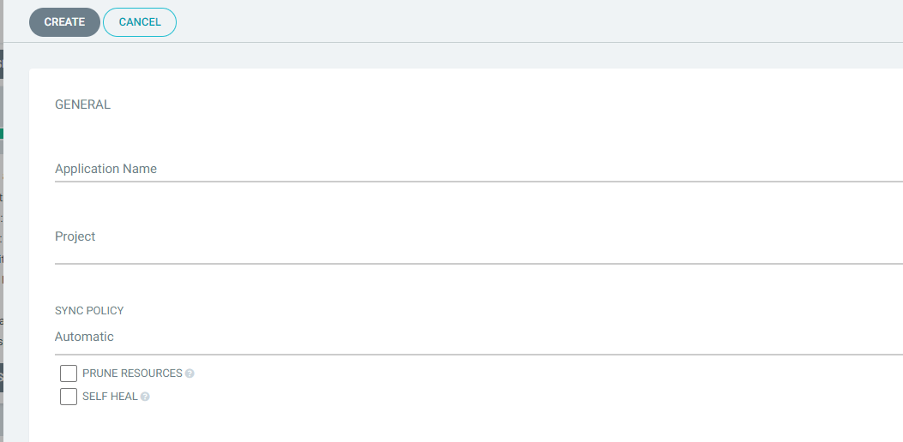
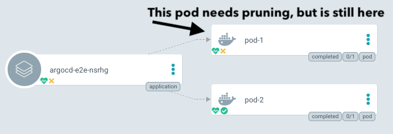

## Automated Sync
- By default, ArgoCD polls Git repositories every 3 minutes to detect changes to the manifests.
- Argo CD can automatically sync apps when it detects differences between the desired manifests in Git, and the live state in the cluster.
    - No need to do manual sync anymore.
    - CI/CD pipelines no longer need direct access.
- **Notes:**
    - An automated sync will only be performed if the application is OutOfSync
    - Automatic sync will not reattempt a sync if the previous sync attempt against the  same commit SHA and parameters had failed.
    - Rollback cannot be performed against an application with automated sync enabled.


### Auto Sync Declaratively
```yml
apiVersion: argoproj.io/v1alpha1
kind: Application
metadata: 
  name: guestbook
  namespace: argocd
spec: 
  destination: 
    namespace: guestbook
    server: "https://kubernetes.default.svc"
  project: default
  source: 
    path: guestbook
    repoURL: "https://github.com/mabusaa/argocd-example-apps.git"
    targetRevision: master
  syncPolicy:
    automated: {}
```
### Auto Sync CLI
```sh
argocd
app create nginx-ingress --repo https://charts.helm.sh/stable --helm-chart nginx-ingress --revision 1.24.3 --dest-namespace default --dest-server https://kubernetes.default.svc --sync-policy automated
```

### Auto Sync Web UI


## Automated Pruning    
- Default no prune: when automated sync is enabled, by default for safety automated sync will not delete resources when Argo CD detects the resource is no longer defined in Git.
- Pruning can be enabled to delete resources automatically as part of the automated sync.

### Auto Prune Declaratively
```yml
apiVersion: argoproj.io/v1alpha1
kind: Application
metadata: 
  name: guestbook
  namespace: argocd
spec: 
  destination: 
    namespace: guestbook
    server: "https://kubernetes.default.svc"
  project: default
  source: 
    path: guestbook
    repoURL: "https://github.com/mabusaa/argocd-example-apps.git"
    targetRevision: master
  syncPolicy:
    automated: {}
        prune: true
```

### Auto Prune- CLI
```sh
argocd app create nginx-ingress --repo https://charts.helm.sh/stable --helm-chart nginx-ingress --revision 1.24.3 --dest-namespace default --dest-server https://kubernetes.default.svc --auto-prune
```

### Auto Prune Web UI

### Prune manually manual sync.


## Automated Self Healing
- By default, changes that are made to the live cluster will not trigger automated sync.
- ArgoCD has a feature to enable self healing when the live cluster state deviates from Git state.
### Auto Self Heal Declaratively
```yml
apiVersion: argoproj.io/v1alpha1
kind: Application
metadata: 
  name: guestbook
  namespace: argocd
spec: 
  destination: 
    namespace: guestbook
    server: "https://kubernetes.default.svc"
  project: default
  source: 
    path: guestbook
    repoURL: "https://github.com/mabusaa/argocd-example-apps.git"
    targetRevision: master
  syncPolicy:
    automated: {}
        selfHeal: true
```

### Auto Prune- CLI
```sh
argocd app create nginx-ingress --repo https://charts.helm.sh/stable --helm-chart nginx-ingress --revision 1.24.3 --dest-namespace default --dest-server https://kubernetes.default.svc --self-heal
```

### Auto Self Heal Web UI


## Sync options
- Users can customize how resources are synced between target cluster and desired state.
- Most of the options available at application level.
```yml
apiVersion: argoproj.io/v1alpha1
kind: Application
metadata:
    name: example
spec:
....
syncPolicy:
    syncOptions:
```
- Some of the options available using resources annotations.
```yml
metadata:
    annotations:
        argocd.argoproj.io…………
```
### No Prune
- ArgoCD can prevent an object from being pruned.

- The app will be in out of sync but still does not prune the resource.
- In the resource itself, can be used as annotation as below:
```yml
metadata:
    annotations:
        argocd.argoproj.io/sync options: Prune=false
```

### Disable Kubectl Validation
- Some resources need to be applied without validating the resources `kubectl apply
validate=false`
- You can achieve this in ArgoCD by at application level or resource level.
    - Application level:
```yml
apiVersion: argoproj.io/v1alpha1
kind: Application
metadata:
    name: example
spec:
....
    syncPolicy:
        syncOptions:
        - Validate=false
```
    - Resource level using annotation :
```yml
metadata:
    annotations:
        argocd.argoproj.io/sync options: Validate=false
```

### Selective Sync
- When syncing using auto sync ArgoCD applies every object in the application.
- Selective sync option will sync only out of sync resources. You need when you have thousands of resources in which sync take a long time and puts pressure on Api server.
- Can be applied at application level only:
```yml
apiVersion: argoproj.io/v1alpha1
kind: Application
metadata:
    name: example
spec:
    ....
        syncPolicy
            syncOptions:
                - ApplyOutOfSyncOnly =true
```

### Prune Last
- ArgoCD can control the sequence of creation/pruning resources, aka waves.
- You can prune some resources to happen as final using “Prune Last”.
- You can achieve this in ArgoCD by at application level or resource level.
    - Application level:
```yml
apiVersion: argoproj.io/v1alpha1
kind: Application
metadata:
    name: example
spec:
....
syncPolicy:
    syncOptions:
        - PruneLast=true
```
    - Resource level using annotation
```yml
metadata:
    annotations:
        argocd.argoproj.io/sync options: PruneLast =true
```

### Replace Resources
- By default ArgoCD use “ kubectl apply” to deploy the resources changes.
- In some cases you need to “Replace/Recreate” the resources, ArgoCD can do this by using replace=true.
- You can achieve this in ArgoCD by at application level or resource level.
    - Application level:
```yml
apiVersion: argoproj.io/v1alpha1
kind: Application
metadata:
    name: example
spec:
    ....
    syncPolicy:
        syncOptions:
            - Replace=true
```
   - Resource level using annotation
```yml
metadata:
    annotations:
        argocd.argoproj.io/sync options: Replace=true
```
### Fail on Shared Resource
- By default ArgoCD will apply the resources even if it was available in multiple applications.
- You can configure the sync to fail if any resource is found in other applications by using FailOnSharedResource =true.
- Can be applied at application level only:
```yml
apiVersion: argoproj.io/v1alpha1
kind: Application
metadata:
  name: example
spec:
  ....
   syncPolicy
     syncOptions:
        - FailOnSharedResource =true
```