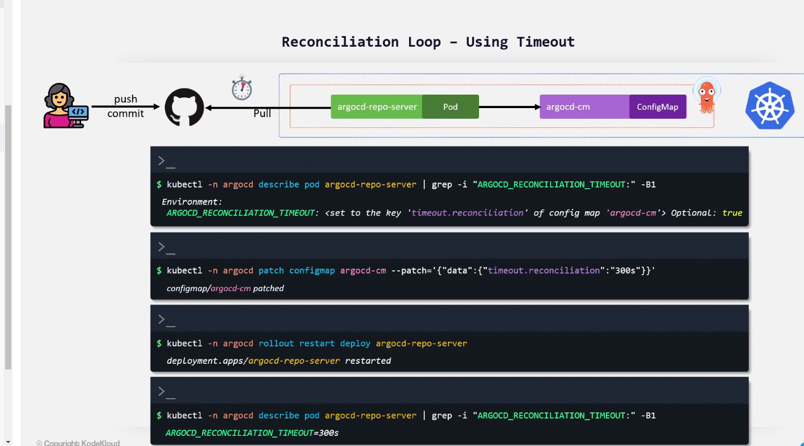

# Reconciliation in Argocd


```sh
kubectl -n argocd describe pod argocd-repo-server | grep -i "ARGOCD_RECONCILIATION_TIMEOUT:" -B1


kubectl -n argocd patch configmap argocd-cm --patch='{"data":{"timeout.reconciliation":"60s"}}'

kubectl rollout restart deployment/argocd-repo-server -n argocd

kubectl rollout history deployment/argocd-repo-server -n argocd
```
# Webhook
### Setting in github side

- Go to setting -> Webhook ->
    - Target URL: `argocd url/api/webhook`
    - HTTP Method: `POST`
    - PostContentType: `application/json`
    - Trigger:
        - `PUSH`