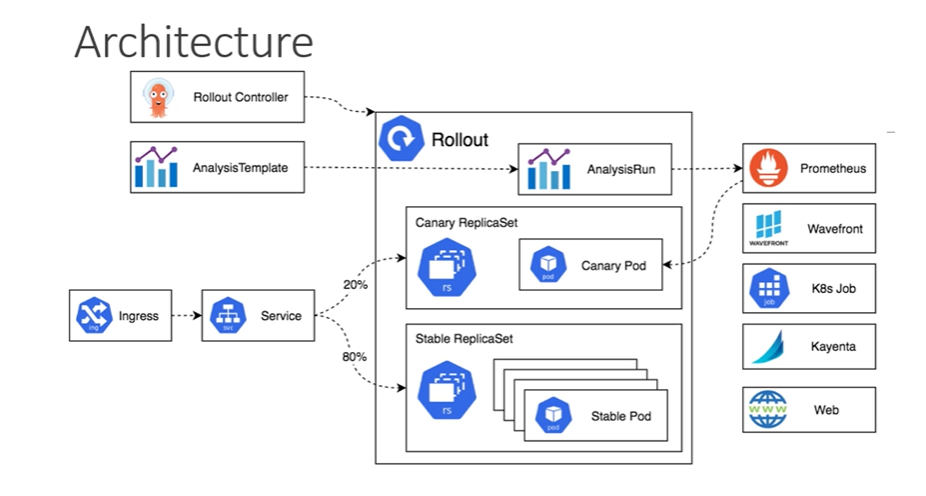

Argo Rollout Concept
1. Rollout
2. Progressive Delivery
- Basically, progressive delivery is a broader concept that's going to describe the set of deployment  practices on releasing changes of a software into the environment.
- This emphasizes on automation as well as reducing the risk and deploying or changing the application in a controlled manner.
- It's built on top of continuous delivery by adding fine grained control over the release process, as 
well, as it's going to enable various features provided by the rollout and monitoring the stability.
3. Deployment Strategies
    - Rolling update
    - Recreate
    - Blue-Green
    - Canary
    - Fine-Grained, Weighted Traffic Shifting