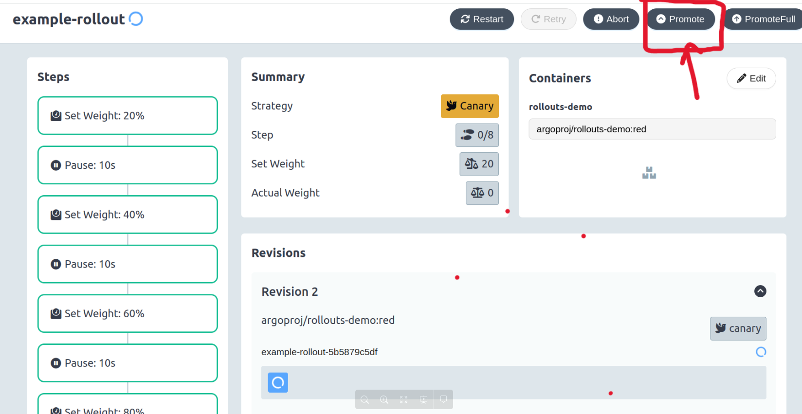

# Research the Argo Rollouts Features.
### The benefits of using Argo Rollouts for application delivery are followings:
- Advance deployment strategies like Canary Deployment, Blue-Green Deployment, Rolling Updates, Recreate, Fine Grained
- We can add manual or automatic promote of deployment steps in rollouts:
- Sample rollout for auto promotion of steps in strategy in every 10 sec
```yaml
apiVersion: argoproj.io/v1alpha1
kind: Rollout
metadata:
  name: example-rollout
spec:
  replicas: 3
  selector:
    matchLabels:
      app: example
  template:
    metadata:
      labels:
        app: example
    spec:
      containers:
      - name: rollouts-demo
        image: argoproj/rollouts-demo:blue
        ports:
        - containerPort: 8080
  strategy:
    canary:
      steps:
      - setWeight: 20
      - pause: {duration: 10s}
      - setWeight: 40
      - pause: {duration: 10s}
      - setWeight: 60
      - pause: {duration: 10s}
      - setWeight: 80
      - pause: {duration: 10s}
```
- If pause duration is not mention, then its need to promote manually


- Add experiments on canary i.e new version to allows users to have ephemeral runs of one or more ReplicaSets.
```yml
apiVersion: argoproj.io/v1alpha1
kind: Rollout
metadata:
  name: rollout-experiment-step
spec:
  replicas: 4
  revisionHistoryLimit: 2
  selector:
    matchLabels:
      app: rollout-experiment-step
  template:
    metadata:
      labels:
        app: rollout-experiment-step
    spec:
      containers:
      - name: rollouts-demo
        image: argoproj/rollouts-demo:blue
        imagePullPolicy: Always
        ports:
        - containerPort: 8080
  strategy:
    canary:
      steps:
      - setWeight: 25
      # The second step is the experiment which starts a single canary pod
      - experiment:
          templates:
          - name: canary
            specRef: canary
          # This experiment performs its own analysis by referencing one or more AnalysisTemplates
          # here. The success or failure of these runs will progress or abort the rollout respectively.
          analyses:
          - name: random-fail
            templateName: random-fail

  # List of AnalysisTemplate references to perform during the experiment
kind: AnalysisTemplate
apiVersion: argoproj.io/v1alpha1
metadata:
  name: random-fail
spec:
  metrics:
  - name: random-fail
    count: 2
    interval: 5s
    failureLimit: 1
    provider:
      job:
        spec:
          template:
            spec:
              containers:
              - name: sleep
                image: alpine:3.8
                command: [sh, -c]
                args: [FLIP=$(($(($RANDOM%10))%2)) && exit $FLIP]
              restartPolicy: Never
          backoffLimit: 0
```
- Experiment auto approval using prometheus metrics result


### Rollouts Auto-scaling by using HPA with metric-server.
```yml
apiVersion: autoscaling/v1
kind: HorizontalPodAutoscaler
metadata:
  name: rollouts-demo-hpa
spec:
  scaleTargetRef:
    apiVersion: argoproj.io/v1alpha1
    kind: Rollout
    name: rollouts-demo
  minReplicas: 3
  maxReplicas: 10
  targetCPUUtilizationPercentage: 30
```
### Analysis of Canary Version before promote to next steps 
```yml
apiVersion: argoproj.io/v1alpha1
kind: Rollout
metadata:
  name: webapp-rollout
spec:
  replicas: 3
  selector:
    matchLabels:
      app: webapp
  template:
    metadata:
      labels:
        app: webapp
    spec:
      containers:
        - name: webapp
          image: nginx:1.19.10
          ports:
            - containerPort: 80
  strategy:
    canary:
      steps:
        - setWeight: 50
        - pause: {}
        - analysis:
            templates:
              - templateName: mock-success-rate-check
        - setWeight: 100
# Analysis Temlate
apiVersion: argoproj.io/v1alpha1
kind: AnalysisTemplate
metadata:
  name: mock-success-rate-check
spec:
  metrics:
    - name: success-rate
      # This is a mock provider for demonstration purposes.
      # In a real scenario, you would use a real metric provider, such as Prometheus.
      provider:
        job:
          spec:
            template:
              spec:
                containers:
                - name: main
                  image: busybox
                  command: [sh, -c]
                  args: ["echo -n 99.5"]
                restartPolicy: Never
      successCondition: "result >= 99"
```
# Compare Argo Rollouts with existing application delivery tools like ArgoCD & Kargo
### ArgoCD
- Version control for deployments using Git repositories.
- Applying infrastructure and application manifests stored in Git to a Kubernetes cluster.
- Synchronization between Git repository and the cluster state
### ArgoRollouts
- Advanced deployment strategies like canary analysis, blue-green deployments, etc.
- Gradual rollout of new application versions with controlled traffic shifting.
- Integration with metrics providers to track application health during deployments
- Integrates with Argo CD for seamless deployment workflows.
### Kargo
- Automates the promotion of changes across different environments (dev, staging, prod) using GitOps principles.
- Integrates with Argo CD to manage deployments across environments.
- Eliminates the need for custom scripting in CI pipelines for environment promotion.

# Find out how we can add permission and Login access using SSO
- Kubernetes offers RBAC for granular control over user permissions.
- Define custom roles in Kubernetes with specific permissions related to Argorollouts (e.g., view rollouts, trigger canary deployments).
- Assign these roles to user groups using Kubernetes RBAC tools.
- Sample RBAC manifest file
```yml
kind: Role
apiVersion: rbac.authorization.k8s.io/v1
metadata:
  name: admin-rollouts
rules:
- apiGroups: ["argoproj.io"]
  resources: ["rollouts"]
  verbs: ["*"]
```

# Check dedicated UI available. and open dashboard through present ingress
### Install plugins

- The kubectl plugin is optional, but is convenient for managing and visualizing rollouts from the UI and command line.

- Brew
```
brew install argoproj/tap/kubectl-argo-rollouts
```
- Manually
  - Install Argo Rollouts Kubectl plugin with curl.
```sh
curl -LO https://github.com/argoproj/argo-rollouts/releases/latest/download/kubectl-argo-rollouts-darwin-amd64
https://github.com/argoproj/argo-rollouts/releases/latest/download/kubectl-argo-rollouts-linux-amd64
# For Linux dist, replace darwin with linux
```
- Make the kubectl-argo-rollouts binary executable.
```sh
chmod +x ./kubectl-argo-rollouts-darwin-amd64
# For Linux dist, replace darwin with linux
```
- Move the binary into your PATH
```sh
sudo mv ./kubectl-argo-rollouts-darwin-amd64 /usr/local/bin/kubectl-argo-rollouts
# For Linux dist, replace darwin with linux
```
- Test to ensure the version you installed is up-to-date:
```sh
kubectl argo rollouts version
```
- Manually create Ingress and Service:
  - Create a Service targeting the Argo Rollouts deployment with port 3100.
  - Create an Ingress resource with a desired hostname and path (e.g., rollouts.example.com/dashboard).
  - Configure the Ingress to point to the Service you created earlier.
