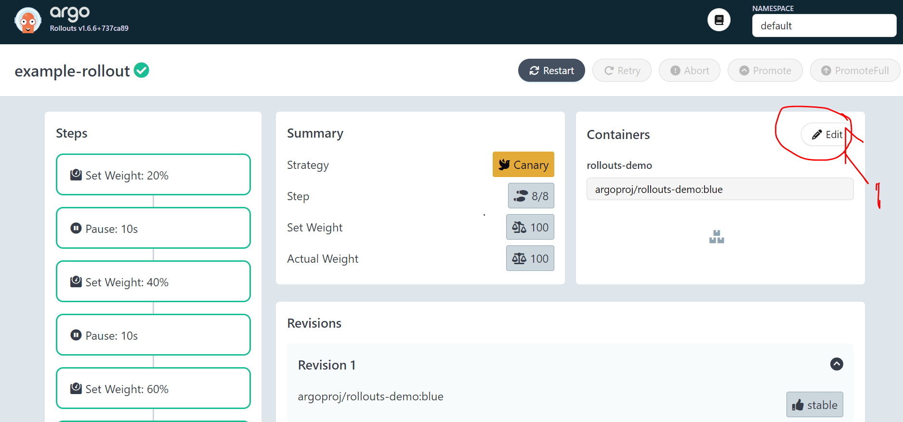
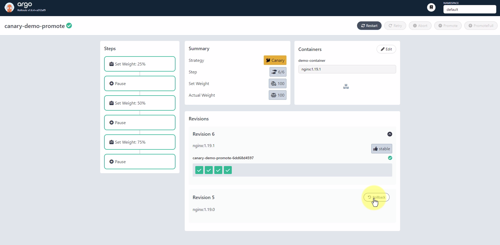

# Start Dashboard
```
kubectl argo rollouts dashboard
```

# Create rollouts with canary strategy
```sh
cd C:\Users\knrs986\raghib\kubernetes-tuts\ArgoRollout\04-canary-rollout
kubectl apply -f 01-rollout-sample.yaml
```
### Verify Rollouts using argo command line
```sh
kubectl argo rollouts list rollouts

kubectl argo rollouts get rollouts <rollout name>

# Watch cont...
kubectl argo rollouts get rollouts <rollout name> --watch
```
### Update version using dashboard



### To abort upgrading process
```sh
kubectl argo rollouts abort <rollout name>
```
### To Rollback to previous version

```sh
kubectl argo rollouts undo <rollout name>
```
### Canary pause and resume
```sh
kubectl argo rollouts pause <rollout name>
kubectl argo rollouts promote <rollout name>
```

### Delete rollout
```sh
kubectl delete -f 01-rollout-sample.yaml
```

### Canary rollout with manually promote
```sh
kubectl apply -f 04-canary-rollout-manual.yaml

# change nginx image to 1.19.1

kubectl delete -f 04-canary-rollout-manual.yaml
```

### Analysis Stage on canary version before promote it to stable version
```sh
# Create Analysis Template
kubectl apply -f 05-mock-ananlysis-template.yaml
# Create Rollout
kubectl apply -f 05-web-rollout.yaml

# Change nginx image version to start rollout
# Check live rollout changes
kubectl argo rollouts get rollout webapp-rollout --watch

# Delete rollout
kubectl delete -f 05-web-rollout.yaml
# Delete Analysis Template
kubectl delete -f 05-mock-ananlysis-template.yaml
```