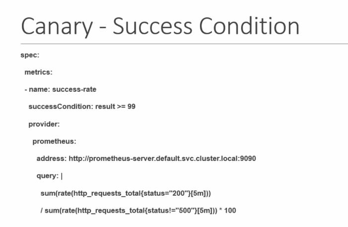

1. In rollout-experiment-step.yaml file
- have experiment steps
2. Experiment Life Cycle

3. Test random fail
```
kubectl apply -f analysis-templates.yaml
kubectl apply -f rollout-experiment-steps.yaml
```
4. Test success auto promotion

```
kubectl apply -f metric-analysis.yaml
kubectl apply -f rollout-auto-promote.yaml
```
### to check analysis
```sh
kubectl describe Analysis Run <name of anaysis>
```