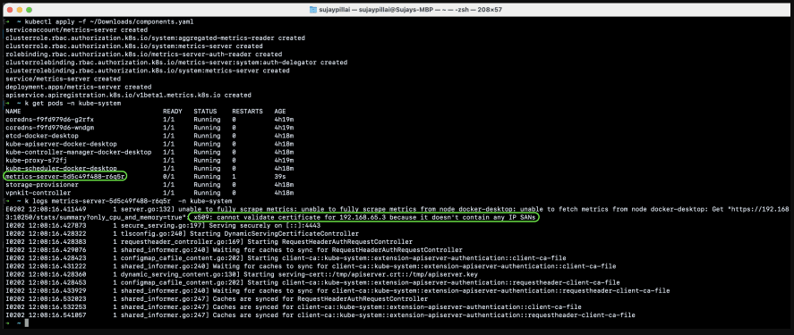
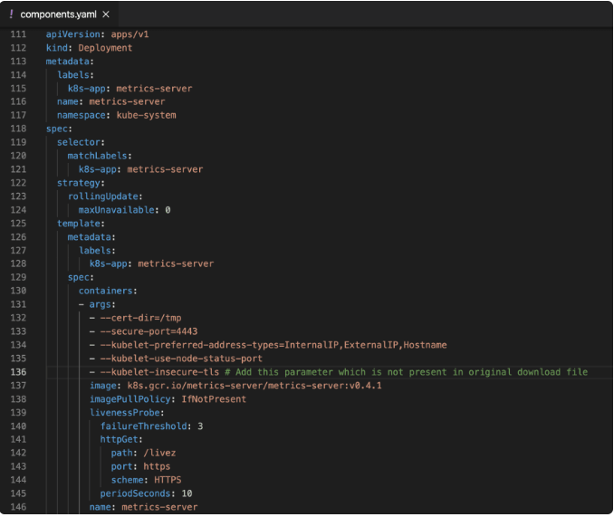

# To measure the  resource utilization, we need to install metric server
### Install metric server in minikube
```sh
# check enable addons
minikube addons list
# enable metrics-server
minikube addons enable metrics-server
# check metric server pods in kube-system namespace
kubectl get pods -n kube-system
```
### Install Metric server in Docker Desktop
##### Release Page link: *https://github.com/kubernetes-sigs/metrics-server/releases*

```sh
kubectl apply -f https://github.com/kubernetes-sigs/metrics-server/releases/download/v0.7.1/components.yaml
# Create that file locally
kubectl apply -f .\component.yaml
```

##### you will see the pods get created but with some errors as highlighted below:


#### Then add in args section
```yml
--kubelet-insecure-tls
```


#### Check metric
```sh
kubectl top node
kubectl top pod -A
```

### Create hpa, rollout and service
```sh
kubectl apply -f 01-hpa.yaml
kubectl apply -f 02-rollout.yaml
kubectl apply -f 03-service.yaml
```

### Increase cpu utilization
```sh
# Create pod
kubectl run -i --tty load-generator --image=busy /bin/bash

while true; do wget -q -O- http://rollouts-demo; done
```

### observer the pod increase in dashborad

### delete rollout
```sh
kubectl delete -f 01-hpa.yaml
kubectl delete -f 02-rollout.yaml
kubectl delete -f 03-service.yaml
```