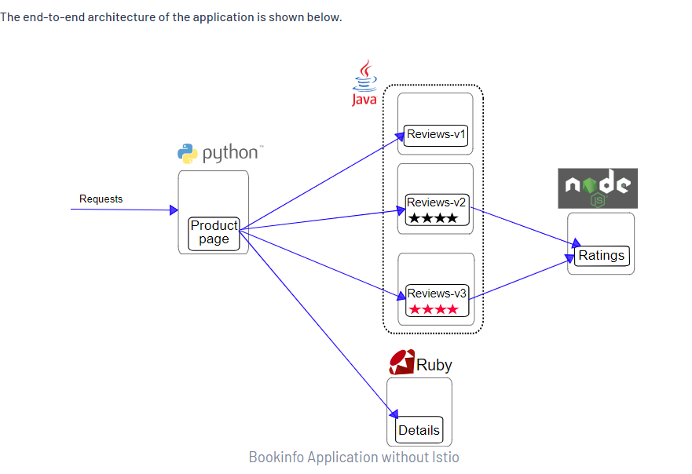

Service mesh help you traffic management of Kubernetes cluster
Also manange East -West traffic

Istio Add
- mutual TLS between service inside k8s
-  Add canary and blue green deployment
- Add Kiali: Kiali track traffic between service to service. helm you understanding the behaviuor of the service


Istio Add side car container in each po in your existsing pod
this side car has envoy proxy and it handle traffic

- Addmission Controller: 
testing addmission controller mutation, not providing storage class in manifest file, storage class addmission controller check and provide it
creating PVC with storage class
kubectl apply -f 01-mutation-strage-class.yaml

Create Resource Quota to restrict the cpu and memory usage in namespace
and limit the cpu usage to 1 and memroy to 2 Gi
Now creating POd which required 10 Gi RAM

kubectl apply -f 03-pod.yaml

will get error due to validation addmission controller


# Install istioctl
## Download Istio
##### Go to the Istio release page to download the installation file for your OS, or download and extract the latest release automatically (Linux or macOS):
##### **LINK**: *https://github.com/istio/istio/releases/tag/1.22.0*
##### **LINK for WINDOW**: *https://github.com/istio/istio/releases/download/1.6.0/istioctl-1.6.0-win.zip*

## istio demo from official doc
- For this installation, we use the demo configuration profile. It’s selected to have a good set of defaults for testing, but there are other profiles for production or performance testing.
```
istioctl install --set profile=demo -y
```
- Add a namespace label to instruct Istio to automatically inject Envoy sidecar proxies when you deploy your application later:
```
kubectl label namespace default istio-injection=enabled
```
- Deploy the Bookinfo sample application:
```
kubectl apply -f samples/bookinfo/platform/kube/bookinfo.yaml
```
- The application will start. As each pod becomes ready, the Istio sidecar will be deployed along with it.
``` 
kubectl get services

kubectl get pods
```
- Architecture


- Expose appication 
```
kubectl apply -f samples/bookinfo/networking/bookinfo-gateway.yaml
```
- Start minikube tunnel (only for minikube)
```
minikube tunnel
```
- access app LInk *http://127.0.0.1/productpage*

- delete sample app
```
kubectl apply -f samples/bookinfo/platform/kube/bookinfo.yaml
kubectl apply -f samples/bookinfo/networking/bookinfo-gateway.yaml
```